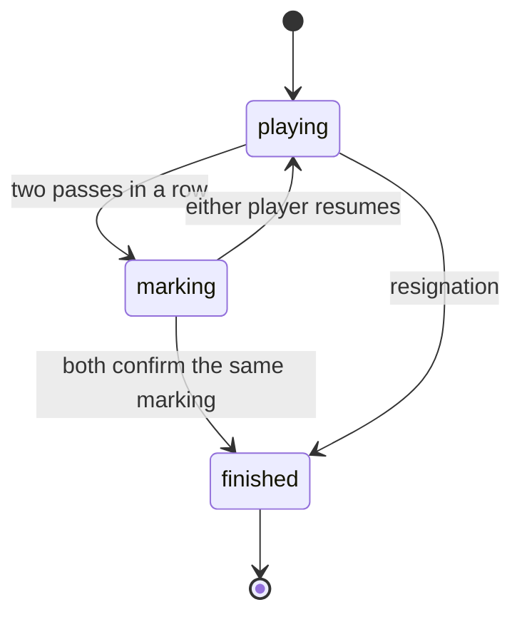

# go-lan design

Date: 2026-08-08

A self-hosted app for playing Go against another person on the same local
network. No accounts, no database, nothing leaves the network.

## Scope

In scope for the first version:

- Two players on a local network. One creates a game and shares a six character
  code; the other joins with it.
- Board sizes 9x9, 13x13 and 19x19. Komi 7.5 by default.
- Complete rules: captures, simple ko, suicide, passing, resignation.
- End of game by agreement: two passes lead to a marking phase where the players
  agree which stones are dead, then the server counts with area scoring.
- Beginner aids: illegal moves refused with the reason, last move highlighted,
  capture counters.
- Take back a move when the opponent agrees.
- A third visitor with the code watches as a spectator.
- Reconnecting after a page refresh keeps your seat.

Deliberately out of scope:

- Accounts, matchmaking, ratings, public lobby.
- Clocks of any kind.
- Handicap stones. Both players are beginners, so it would compensate nothing.
- Persistence. Games live in memory and are lost when the server restarts.
- Positional superko. Simple ko covers essentially every real game; superko is
  noted as a possible extension.
- Computer opponents, SGF import, game review, chat.

## Architecture

Four packages in an npm workspaces monorepo:

```
packages/
  rules/       pure game logic, zero dependencies
  protocol/    wire message types, zod validation, snapshot codec
  server/      Fastify, WebSocket, in-memory rooms
  web/         React, Vite, SVG board
```

`rules` and `protocol` are imported by both `server` and `web`. This is the
central decision of the design: there is exactly one definition of a legal move,
and it runs in both places. The browser calls it to give instant feedback before
sending anything; the server calls the same function as the final authority. The
two cannot drift apart because there is nothing to drift.

## Rules engine

Pure functions over a plain state object. Nothing mutates; every operation takes
a state and returns a new one, which makes the engine trivial to test and lets
the client speculatively evaluate a move without touching its own state.

```ts
type GameState = {
  boardSize: number
  komi: number
  board: Int8Array          // 0 empty, 1 black, 2 white
  turn: Color
  captures: { black: number; white: number }
  koPoint: Point | null
  passesInARow: number
  phase: 'playing' | 'marking' | 'finished'
  moves: MoveRecord[]
  dead: boolean[]
  confirmed: { black: boolean; white: boolean }
  result: GameResult | null
}
```

`applyMove(state, color, move)` returns either the new state or a rejection
reason: `occupied`, `suicide`, `ko`, `not-your-turn`, `out-of-bounds` or
`wrong-phase`. That reason is what the interface shows the player, so the
beginner aid falls out of the engine rather than being reimplemented in the UI.

Everything rests on one non-trivial operation, `collectGroup`, a flood fill that
returns the stones connected to a point and their liberties. Placing a stone
means: put it down, remove any adjacent enemy group left with no liberties, and
if nothing was captured and your own group has no liberties, reject the move as
suicide.

### Ko

Simple ko only. After a move that captures exactly one stone and leaves the
played stone alone with exactly one liberty, that captured point is banned for
the opponent's next move. Without this, both players could recapture forever.

### Undo

Undo replays the game from an empty board with the last move dropped. Replaying
361 moves is instant, and it means no snapshots need to be stored and no
inverse of `applyMove` needs to exist.

## Game lifecycle



In the marking phase either player may click a group to mark it dead or bring it
back to life. Any change clears both confirmations, so nobody can accept a count
and then quietly alter it. If the players cannot agree, either one resumes play
and the dispute is settled on the board, which is how it works over the board.

Scoring is by area, the Chinese convention. Dead stones are lifted, then each
player counts their remaining stones plus the empty intersections surrounded by
their colour alone. Points touching both colours are neutral. White adds komi.

## Server

A single Node process serves the built frontend as static files and accepts
WebSocket connections at `/ws`, both on port 8080, bound to `0.0.0.0` so other
machines on the network can reach it.

State is a `Map` from game code to room. A room holds the `GameState`, up to two
occupied seats, and the set of open sockets. Codes are six characters from an
alphabet with no visually ambiguous glyphs, because people will read them aloud.

Identity without accounts is a token: on joining, the server issues a UUID that
the browser stores in `localStorage` under the game code. Reconnecting means
sending the token back. Without this, an accidental refresh would lock a player
out of their own game with no way back in.

Because everything is in memory, rooms with no open sockets for sixty minutes are
deleted by a periodic sweep. Skipping this would be a slow memory leak.

After every change the server broadcasts a complete snapshot of the state. A
19x19 board is a few hundred bytes, so sending deltas would trade a whole class
of desynchronisation bugs for an optimisation nobody would notice.

### Messages

Client to server: `create`, `join`, `rejoin`, `play`, `pass`, `resign`,
`toggleDead`, `confirmScore`, `resumeGame`, `undoRequest`, `undoRespond`.

Server to client: `welcome` (token, assigned colour and first snapshot),
`snapshot`, and `rejected` (reason and a human readable message).

Presence and a pending undo request are fields inside the snapshot rather than
separate messages. They are part of what a client needs to render the current
situation, and a separate message would only be a second source of truth.

Every inbound message is validated with zod. It arrives over the network, and
being on a home network is not a reason to trust it.

## Web client

Two routes: `/` to create a game or enter a code, and `/g/:code` to play.

The board is SVG rather than canvas. Each intersection is a real DOM element, so
clicks, hover and tests do not depend on translating pixel coordinates, and 361
elements are nothing for a browser.

Hovering an empty intersection shows a translucent stone in your colour, but only
where the move is legal. Where it is not, the cursor changes and a tooltip gives
the reason straight from the engine's rejection. During the marking phase, dead
stones are drawn faded with a cross and the resulting territory is shaded, so the
count is visible before anyone confirms it.

Client state is a `useReducer` inside a `useGameSocket` hook. There is one source
of truth, the server snapshot, so a state management library would add ceremony
without adding anything.

## Testing

Vitest, concentrated on `rules`, where the real risk lives. Test positions are
written as ASCII drawings and parsed, so a capture test looks like a board:

```
.X.
XO.
.X.
```

Covered: simple and multiple captures, suicide, the awkward case of a move that
would be suicide but captures and is therefore legal, a full ko sequence
including the ban expiring, the two-pass transition, marking behaviour and area
scoring with and without dead stones.

The server is tested at the room level with fake sockets: joining, seat
assignment, reconnection by token, spectators and rejection of out-of-turn moves.

No end-to-end tests in this version.

## Deployment

A multi-stage Dockerfile builds both sides and produces a `node:24-alpine` image
running as a non-root user, plus a `docker-compose.yml` exposing port 8080 with
`restart: unless-stopped`. Access is over plain HTTP: it is a home network, and
`ws://` over `http://` needs no certificate.

## Language

Everything in the repository is written in English: identifiers, comments,
interface copy, documentation and commit messages. Go's vocabulary is Japanese
and stays untranslated, so `komi`, `atari` and `ko` appear as they are.
